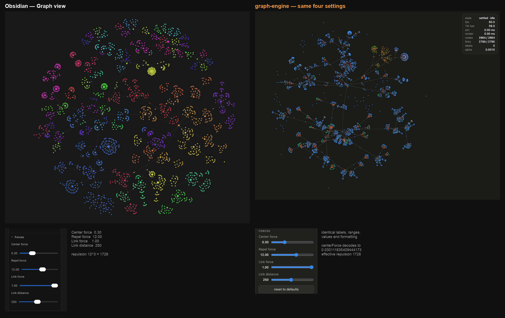
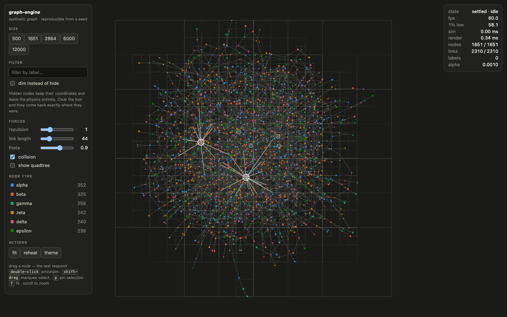
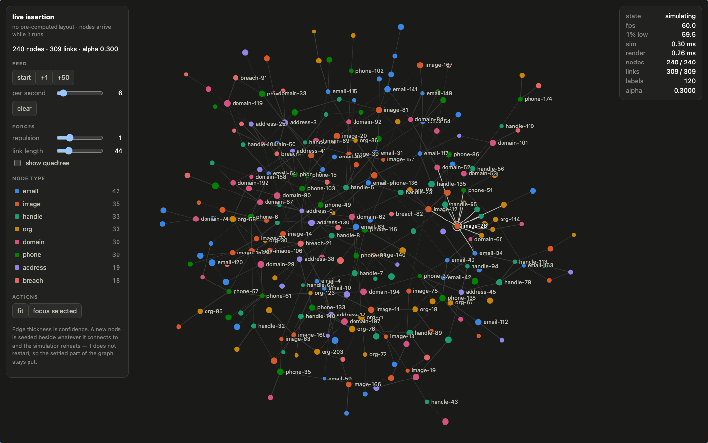
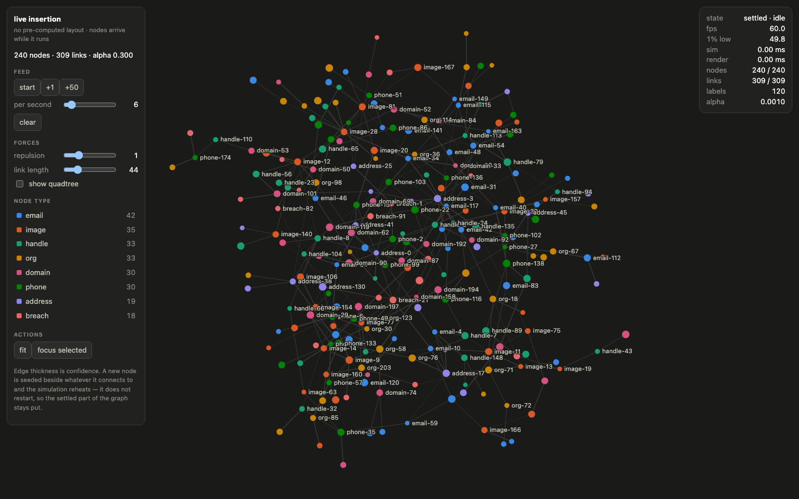

# forcefield

**[Live demo →](https://3moorydxb.github.io/forcefield/)** — drag a node, switch the theme, 2,864
nodes at 60fps, right in the browser.



*Same hierarchy, same four settings, side by side — not a benchmark win, just a well-known app's
graph view next to this engine's on identical data. What it actually shows: 2,864 nodes at 60fps in
the browser, measured live, not a screenshot claim. (Captured before the rename, so the right-hand
panel is still labelled `graph-engine`.)*

A force-directed graph engine: Barnes-Hut many-body simulation, velocity-Verlet integration,
drag / pin / filter / zoom, behind a swappable renderer interface.

**Zero dependencies. Zero build dependencies.** TypeScript in, ESM out, nothing in
`node_modules`.

```bash
npm run build      # tsc
npm test           # 99 tests, node:test
npm run serve      # http://localhost:8902/examples/basic/
```

---

## Install

Not on npm yet. Until it is, the honest way to depend on it is a git install:

```bash
npm i github:3moorydxb/forcefield
```

That runs `prepare` (`npm run build`) as part of the install — the one devDependency,
`typescript`, compiles `dist/` right there, so a git install ends up with exactly the `dist/` a
published package would ship. Newer npm versions print an `allow-scripts`-style warning when a git
dependency runs a lifecycle script on install; that script is `prepare`, and it is what produces
`dist/` — let it run. **Committing `dist/` to make the warning go away is not the fix.** This
repo's own Pages workflow exists because `dist/` being gitignored once meant a build step got
skipped and the demo shipped blank — the fix there was "always build first", never "check in the
output". Same principle here: build on install, don't let a compiled copy drift out of sync with
the source that produced it.

```bash
npm i forcefield   # once published
```

---

## What it is for

It does not know what a node means. There is no node type, no colour and no filter here that
belongs to any one product; a consumer supplies its own vocabulary through `type`, `data` and a
`Theme`, and the engine treats all of it as opaque.

It was built for two consumers at once, deliberately:

| | a saved hierarchy | a live investigation |
|---|---|---|
| nodes | thousands, coordinates already stored | grows while you watch, no layout at all |
| edges | strictly hierarchical | arbitrary, confidence-weighted |
| needs | filter by type and branch, dim the background | insertion into a running simulation |

The second one is harder, and building for it makes the first one free. **Replaying stored
coordinates would have served the hierarchy and been useless to the live case** — and on the real
hierarchy this was tested against, the stored coordinates only covered 55% of the nodes anyway.

---

## Quick start

```ts
import { GraphView, Filters, themeByName } from 'forcefield';

const view = new GraphView({ container: document.getElementById('app')! });

view.load({
  nodes: [{ id: 'a', type: 'person' }, { id: 'b', type: 'org' }],
  links: [{ source: 'a', target: 'b', weight: 0.8 }],
});

view.fitWhenSettled();
view.start();

// Show one branch. Everything else keeps its coordinates and leaves the physics.
view.filter(Filters.branch('a', { direction: 'out', maxDepth: 3 }));

// Or keep it on screen and push it back instead.
view.highlight(Filters.branch('a', { direction: 'out' }));

// Switch themes at runtime. Setting `.theme` marks the frame dirty itself —
// no separate invalidate() call needed.
view.theme = themeByName('light')!;
```

`GraphView` is optional glue. `Simulation`, `Canvas2DRenderer` and `InteractionController` are
usable on their own if you already own your render loop.

---

## Why this and not sigma.js or cosmograph

Both were read before anything was written here. Both are MIT, so licence was not the deciding
factor.

**[sigma.js](https://github.com/jacomyal/sigma.js)** — a WebGL *renderer* built on graphology. It
is the strongest renderer of the three and it is genuinely fast. But it does not simulate: you
supply coordinates. The usual pairing is `graphology-layout-forceatlas2`, where
`barnesHutOptimize` **defaults to `false`** (so the default really is O(n²)) and which has **no
notion of a fixed or pinned node** — and pin-and-drag is the central requirement here, not a
nice-to-have. Choosing sigma means writing the simulation anyway and inheriting a WebGL renderer
plus a graph library to get it.

**[cosmos.gl](https://github.com/cosmograph-org/cosmos)** — GPU force simulation, hundreds of
thousands of points, genuinely excellent at what it does. It is the wrong shape for the live case:
simulation state lives in GPU textures and the API takes whole arrays
(`setPointPositions`, `setLinks`) with **no incremental add**, so "one node arrives" means
rebuilding every buffer. It also brings a luma.gl dependency and needs WebGL2 — and positions
living on the GPU makes CPU-side hit-testing, labelling and filtering awkward.

**A third data point, worth more than either:** the closest comparable open-source tool — an OSINT
graph investigation platform — renders its case graph with `react-force-graph-2d`, i.e. **canvas
plus d3-force**, and runs the layout in a **Web Worker**. It uses React Flow only for its pipeline
*editor*, where a DOM node per element is the right call. Canvas + a real force simulation is what
someone solving this exact problem independently arrived at.

**So: the simulation is written here** — that was the actual requirement — and the renderer sits
behind a `Renderer` interface with a Canvas 2D implementation. At the scale this targets (single-
digit thousands) Canvas holds frame rate with room to spare and costs no shader compilation, no
context-loss handling and no dependency.

**Where that stops being true, say so plainly: past ~100k nodes, use cosmos.gl.** This engine is
not going to beat a GPU at brute force, and pretending otherwise would be the kind of claim that
gets found out. `Renderer` is the seam; swapping in a WebGL backend changes nothing else.

---

## Measured

Real numbers from `bench/`, not impressions. Reproduce with `node bench/tick.mjs` and
`/bench/?n=1651`.

### Simulation, headless (`node bench/tick.mjs`, Node 26, darwin/arm64, median of 60 ticks)

| nodes | links | Barnes-Hut | ticks/s | exact O(n²) | speed-up | ms / (n·log₂n) |
|---|---|---|---|---|---|---|
| 500 | 695 | 0.423 ms | 2362 | 2.153 ms | 5.1× | 94.5 ns |
| **1,651** | 2,311 | **1.852 ms** | **540** | 25.328 ms | **13.7×** | 104.9 ns |
| **2,864** | 4,007 | **3.414 ms** | **293** | 79.828 ms | **23.4×** | 103.8 ns |
| 6,000 | 8,399 | 8.336 ms | 120 | 390.602 ms | 46.9× | 110.7 ns |
| 12,000 | 16,797 | 18.838 ms | 53 | — | — | 115.9 ns |
| 25,000 | 34,999 | 42.419 ms | 24 | — | — | 116.1 ns |

The last column is time per node per log₂(n). It stays between 94 and 116 ns across a **50× range
of graph sizes** — that is what O(n log n) looks like when it is real rather than claimed. The
`theta = 0` column is the same code with the quadtree switched off, and at 2,864 nodes the naive
version costs **79.8 ms per tick — 12 fps, before drawing anything.**

### Full frame, in-browser

⚠️ **Measured on a browser with no GPU acceleration** (`getContext('webgl')` returns `null`, so
Canvas 2D is rasterised entirely on the CPU, at dpr 1). These are therefore a **floor**, not a
representative figure for a normal machine.

| graph | mode | fps | 1% low | sim | render call | drawn |
|---|---|---|---|---|---|---|
| 1,651 synthetic | physics every frame | 47.7 | 46.6 | 1.89 ms | 0.25 ms | 1651 nodes / 2308 links |
| 1,651 synthetic | render only, settled | 50.9 | 49.5 | — | 0.26 ms | 1651 / 2308 |
| **2,864 real hierarchy** | **physics every frame** | **51.2** | **50.0** | **3.16 ms** | **0.52 ms** | 2864 / 2795 |
| 100 synthetic | physics every frame | 60.0 | 56.2 | 0.24 ms | 0.52 ms | 100 / 135 |

**Read the last row before the others.** At 100 nodes the same harness hits a clean 60 — so the
harness can do 60, and the gap at 1,651 is rasterisation, not the engine. The engine's own work
per frame is 2.1 ms at 1,651 nodes and 3.7 ms at 2,864, i.e. **13% and 22% of a 60fps budget.**
The remaining ~19 ms is the software rasteriser painting the canvas, which happens after the
measured call returns.

That finding is why `GraphView.redrawPolicy` defaults to `'on-change'`: a settled graph with
nothing hovered and nothing selected **skips the draw entirely**, so idling costs nothing at all.

On the live demo, with GPU acceleration available, the same 2,864-node hierarchy holds **60fps
sustained, 59.2 1%-low** — the number the demo link at the top is quoting.

---

## What it does

### Simulation
Velocity-Verlet, not the semi-implicit Euler most graph layouts use — it carries the previous
acceleration and averages it with the new one, so a dragged node's neighbours trail it instead of
overshooting and snapping back.

Forces run in three phases per tick so they all see one quadtree: `pre` (centring, a pure
translation, before the tree is built) → build → `relax` (collision, positional) → `force`
(repulsion, springs, gravity). All of them are removable and replaceable; `Force` is a two-method
interface.

Alpha decays geometrically and the graph settles. `reheat()` wakes it. `alphaTarget` **holds** it
warm — that distinction is what makes a drag feel alive rather than going limp halfway through the
gesture.



*1,651 nodes, 2,310 links, with the Barnes-Hut subdivision drawn. Cells subdivide only where
nodes are dense — that is the O(n log n).*

### Pinning
A pinned node does not integrate, but it stays in the quadtree and stays on both ends of its
springs, so it goes on pushing the graph around while standing still. Centring stands down as
soon as anything is pinned, because a pin is the user saying "this belongs here" and a correction
that slides it is a pin that does not hold.

### Filtering
**Filtering never restarts the simulation.** It sets a hidden flag: hidden nodes leave the
quadtree and every force, are not integrated, and keep their coordinates frozen. Clear the filter
and they are exactly where they were.

Verified in the browser on 2,864 real nodes: isolating a 46-node branch moved **0 nodes** and left
alpha byte-identical.

`Filters` composes — `ofType`, `branch` (following link direction), `within`, `search`, `degree`,
`predicate`, `and` / `or` / `not`, `expand`.

`filter()` removes; `highlight()` dims. Different questions: *show me only this branch* versus
*where does this branch sit in the whole thing*.

Both are in the tree demo: click a node to isolate its subtree, tick **dim instead of hide** to see
the same branch in context.

### Rendering
Canvas 2D, behind an interface. Everything sharing a style goes into one path and is stroked or
filled once — thousands of driver state changes become about twenty. Off-screen nodes are culled;
labels are capped, gated on zoom, and chosen by degree.

Three themes ship — `dark` (the default), `light`, `midnight-glow` — and each is validated at
module load against a seven-rule contract: palette shape, WCAG contrast floors on every text and
chrome colour, and (the rule with the teeth) that no two style buckets are ever distinguished by
colour alone. A theme that fails the contract does not fail quietly; the package fails to import.
`view.theme = themeByName('light')` swaps at runtime — the examples' theme picker does exactly
that, plus re-deriving the page's own chrome from the theme and remembering the choice. See
`themes/README.md` for the contract and how to add a theme.

The default (`dark`) palette is validated colourblind-safe (worst adjacent pair ΔE 8.4 protan). On
dark all eight slots clear 3:1 against the surface; on light three do not, which is why the
hovered node always gets a label and the examples ship a legend — identity is never carried by
colour alone. Replace `Theme.palette` with your own and nothing else changes.

Types are assigned palette slots **in fixed order over the whole graph, never cycled**, so
filtering down to three types does not repaint them, and a ninth type folds into `other` rather
than getting an invented hue.

### Interaction
Drag (the rest respond), pin/unpin on double-click, hover, click select, shift-drag marquee
multi-select, wheel zoom about the cursor, pan, two-finger pinch, and `p` / `f` / `Escape`.



*Mid-gesture, mouse still down: the dragged node sits exactly under the cursor, alpha is held at
0.3, and all 12 of its neighbours have moved.*

---

## One rule worth stating

**Direction is an explicit field. It is never the sign of a number.**

CSS clamps a negative `animation-duration` to `0s` — no error, no warning, `getAnimations()`
returns nothing. A sibling project encoded "spin the other way" as a negative duration and shipped
a six-layer animation in which three layers stood perfectly still, through a design review,
unnoticed. "Clamped to nothing" and "never written" look identical.

The bug is not the clamp. It is overloading a magnitude to carry a direction. So here, magnitudes
(durations, radii, masses, zoom factors) are positive and **validated**, direction is a string
union, and a negative magnitude throws instead of quietly becoming zero. See
`src/core/direction.ts` and the tests that enforce it.

---

## Examples

```bash
npm run build && npm run serve
```

- `/examples/basic/` — synthetic graph generated from a seed, so the benchmark is reproducible by
  anyone with no data at all. Size, forces, θ, quadtree overlay, filtering.
- `/examples/live/` — nodes inserted one at a time into a running simulation, confidence-weighted
  edges. 
- `/examples/tree/` — a large hierarchy. Defaults to a **synthetic** 2,864-note vault built from a
  fixed seed, so the demo ships with no private data and is reproducible by anyone. `npm run serve`
  does not generate it — run this once first:

  ```bash
  npm run demo:data     # synthetic-vault.mjs → markdown-tree.mjs → examples/tree/demo.graph.json
  ```

  Pass `?data=your-export.graph.json` to point it at your own vault's export instead — see
  `examples/adapters/README.md`. Any `*.graph.json` you generate is `.gitignore`d, same as always.

---

## Themes

Ships three (`dark`, `light`, `midnight-glow`); adding a fourth is documented start-to-finish in
`themes/README.md` — that folder is the whole contribution surface, and nothing in it depends on
`src/`. The contract's own rule, in one sentence: **state is glyph + word + colour, never colour
alone.**

---

## Adapters — pluggable into anything

`type` and `data` on a node or link are the consumer's own vocabulary — the engine assigns `type` a
palette slot and lets you filter by it, and never reads `data` at all. Whatever turns a real source
into `{ nodes, links }` is an adapter, and adapters live entirely in `examples/`, never in `src/`:
the engine stays at zero dependencies while an adapter is free to take its own.

Three ship:

- `markdown-tree.mjs` — a folder of markdown notes, each naming its parent with a wikilink.
- `synthetic-vault.mjs` — writes a synthetic markdown vault to disk from a seed, so the tree demo
  (and its benchmark) don't depend on anyone's real notes.
- `codebase.mjs` — an import graph of a codebase, via `dependency-cruiser`. **Scope: TypeScript and
  JavaScript only** — "any codebase" would be a later claim, this is the first one.

See `examples/adapters/README.md` for the exact field contract and how to write your own in five
steps.

---

## What v0.1.0 does not do

Honest about the edges, not just the strengths:

- **No WebGL renderer.** `Renderer` is an interface for exactly this reason, but only the Canvas 2D
  implementation exists — the seam is real, the second backend is not written.
- **No worker-thread simulation.** The tick runs on the main thread; a very large graph competes
  with layout and paint for the same frame budget.
- **`Canvas2DRenderer` and `InteractionController` have no unit tests.** They're exercised in the
  browser and verified by screenshot (see `shots/`), which catches what a human eye catches and
  nothing else — weaker than a real test.
- **Touch is tested only via synthetic pointer events**, not a real device. Pinch and two-finger
  pan work in that harness; nobody has put a phone on it yet.
- Past ~100k nodes the honest answer is still cosmos.gl, not this — see "Why this and not sigma.js
  or cosmograph" above.

---

## Layout

```
src/core/        graph · quadtree · simulation · filter · direction · forces/
src/render/      renderer interface · canvas2d · camera · theme (re-exports themes/)
src/interaction/ controller
src/graphView.ts optional glue: view + loop
themes/          the Theme contract + dark/light/midnight-glow — the whole contribution surface
examples/        example pages and adapters — NOT part of the engine
bench/           headless tick benchmark + in-browser frame benchmark
test/            99 tests, node:test, no dependencies
site/            static Pages landing — no imports from dist/, so it renders even if the build breaks
.github/         Pages workflow: build, test, generate the synthetic demo graph, guard, deploy
```

If a consumer's concept ever appears in `src/`, that is the bug.

---

## Contributing

- New theme → `themes/README.md`.
- New adapter → `examples/adapters/README.md`.
- `npm test` has to pass — 99 tests, `node:test`, zero dependencies.
- The engine itself takes none, ever, and that is not up for negotiation in a PR — an adapter or an
  example may take its own.

## Licence

MIT.
